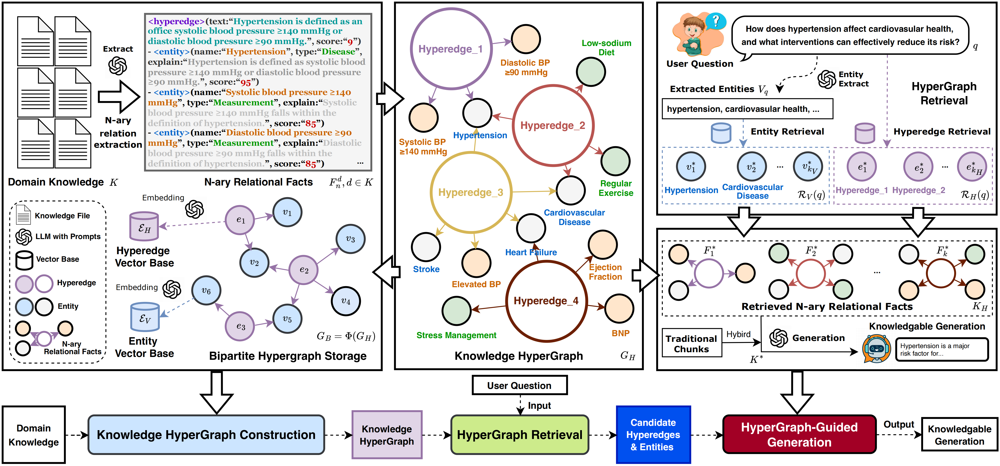

# HyperGraphRAG

HyperGraphRAG: Retrieval-Augmented Generation via Hypergraph-Structured Knowledge Representation [[paper](https://arxiv.org/abs/2503.21322)]

##  Overview 



## Environment Setup
```bash
conda create -n hypergraphrag python=3.11
conda activate hypergraphrag
pip install -r requirements.txt
```

## Quick Start
### Knowledge HyperGraph Construction
```python
import os
import json
from hypergraphrag import HyperGraphRAG
os.environ["OPENAI_API_KEY"] = "your_openai_api_key"

rag = HyperGraphRAG(working_dir=f"expr/example")

with open(f"example_contexts.json", mode="r") as f:
    unique_contexts = json.load(f)
    
rag.insert(unique_contexts)
```

### Knowledge HyperGraph Query
```python
import os
from hypergraphrag import HyperGraphRAG
os.environ["OPENAI_API_KEY"] = "your_openai_api_key"

rag = HyperGraphRAG(working_dir=f"expr/example")

query_text = 'How strong is the evidence supporting a systolic BP target of 120–129 mmHg in elderly or frail patients, considering potential risks like orthostatic hypotension, the balance between cardiovascular benefits and adverse effects, and the feasibility of implementation in diverse healthcare settings?'

result = rag.query(query_text)
print(result)
```

> For evaluation, please refer to the [evaluation](./evaluation/README.md) folder.

## BibTex

If you find this work is helpful for your research, please cite:

```bibtex
@misc{luo2025hypergraphrag,
      title={HyperGraphRAG: Retrieval-Augmented Generation via Hypergraph-Structured Knowledge Representation}, 
      author={Haoran Luo and Haihong E and Guanting Chen and Yandan Zheng and Xiaobao Wu and Yikai Guo and Qika Lin and Yu Feng and Zemin Kuang and Meina Song and Yifan Zhu and Luu Anh Tuan},
      year={2025},
      eprint={2503.21322},
      archivePrefix={arXiv},
      primaryClass={cs.AI},
      url={https://arxiv.org/abs/2503.21322}, 
}
```

For further questions, please contact: luohaoran@bupt.edu.cn.

## Acknowledgement

This repo benefits from [LightRAG](https://github.com/HKUDS/LightRAG), [Text2NKG](https://github.com/LHRLAB/Text2NKG), and [HAHE](https://github.com/LHRLAB/HAHE).  Thanks for their wonderful works.